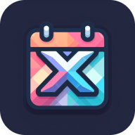
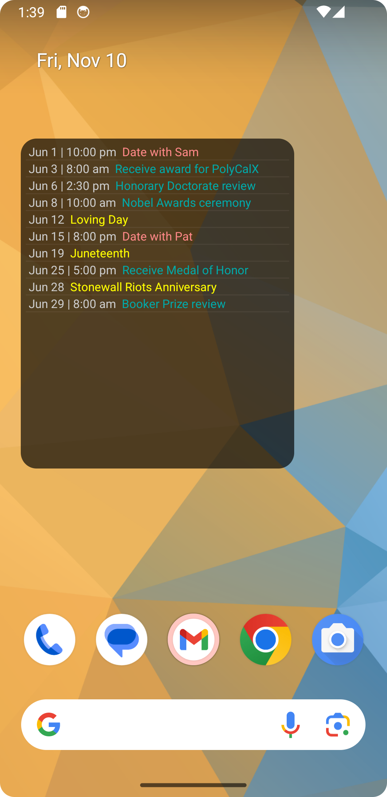

PolyCalX
--------
<bold>A colorful, concise text-based calendar widget for Android.</bold>

## Description
This is a widget for Android to display the calendar/agenda in a concise
text-based form factor.

It has two major differences that sets it apart from other similar widgets:

* There is no repetition: when an event spans a long timeframe, it will just be shown once
  but stay in the list as long as it is still undergoing. For example, if an event
  starts on May, 1st, and ends May, 10th, then if today is May, 5th, the event will still
  be shown at the top of our list, shown as starting on May, 1st, and will stay there
  until May, 10th. This simple intuitive feature is essential in displaying the agenda
  concisely.
* Each line is color coded depending on the calendar the event is taken from.
  This is intended to be especially useful for people who must coordinate multiple calendars.

It is relatively simple, at least by Android project standards, and attempts
to use the standard practices for each part. By default, it has no calendar
permissions, and so it will be in "screenshot mode" (which was also used to
prepare the app widget preview).

Tested on Android 10 and 13 (API 33).

## Install & Settings
For the moment use the APK in the [latest GitHub Release](https://github.com/lrq3000/PolyCalX/releases/latest).

After you place the widget on your homescreen, make sure to tap on it to open the settings, and then tap on "Calendar Permission"
to allow the widget to access your calendar. Otherwise, by default, it shows fake data as an example.

You can also select which calendars you want to show (each in a different color - use another app such as Etar to modify the colors).

The date/time format can also be changed.

## License

Licensed under the GNU General Public License v2 (GPLv2).

This is a fork of the awesome [PolyCal](https://github.com/jasongyorog/PolyCal).

## Similar projects

* [MinCal](https://github.com/mvmike/min-cal-widget) widget for Android.
